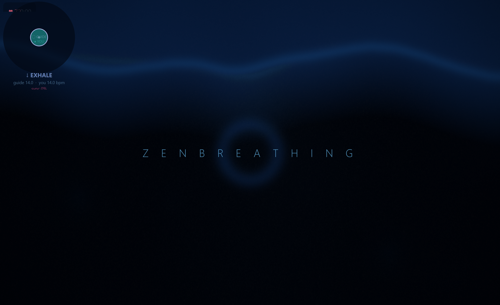
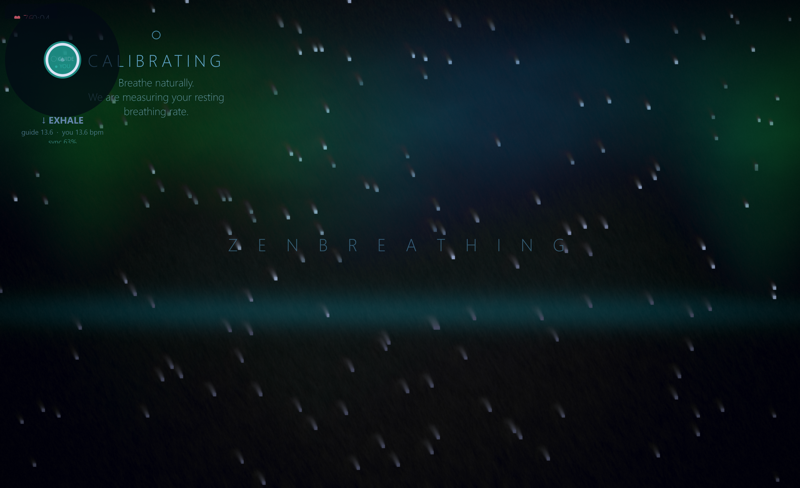
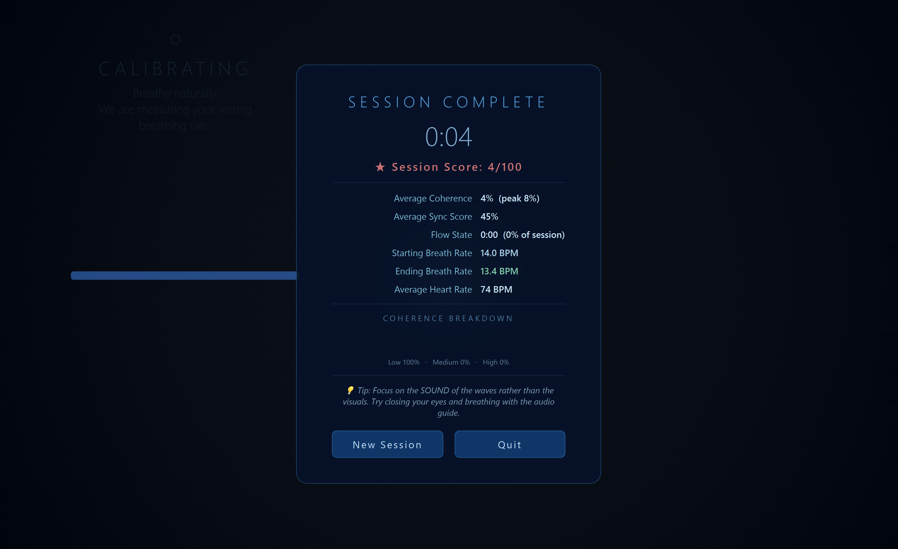

# ZenBreathing

A real-time biofeedback breathing art experience. Plug in a **Polar H10** chest strap, and the app listens to your breath via accelerometer and ECG, then drives a living GLSL environment — an underwater ocean, a northern-lights aurora, or a Journey-style glowing orb — that responds to how well you synchronize with its slow, resonant 6 BPM pacer.

No gamification points, no achievement badges. Just you, your breath, and something beautiful that breathes with you.

---

## Screenshots


*Ocean theme — the outer white ring is the pacer, the teal fill tracks your breath. The ocean brightens as you synchronize.*


*Aurora theme — coherence drives color saturation across the northern-lights curtain.*


*End-of-session report showing coherence trajectory, breathing rate evolution, and flow time.*

> Run `python run_zen.py --demo` to try it immediately without any hardware.

---

## Why this exists

The short answer: RSA biofeedback works, but clinical tools are ugly, and consumer apps are gamified to the point of undermining the whole point.

The longer answer starts with a paper trail. Research on **respiratory sinus arrhythmia (RSA)** shows that breathing at 0.1 Hz (roughly 6 breaths per minute) maximally entrains the autonomic nervous system and amplifies heart rate variability in the LF band — a state sometimes called cardiac coherence. The HeartMath group has studied this for decades. It correlates with reduced cortisol, improved attention, and faster stress recovery. What existing tools lack is a feedback medium that doesn't feel like a hospital waiting room.

**[Breath of Life](https://dl.acm.org/doi/10.1145/3311350.3347180)** (Zhu et al., CHI Play 2019) showed that biofeedback presented as a game mechanic — one where your breathing *is* the controller — produces measurable HRV improvements with much better adherence than guided breathing apps. **[Ethereal Breathing](https://dl.acm.org/doi/10.1145/3581641.3584043)** (Vidal et al., CHI 2023) extended this with holographic display and showed that ambient, low-abstraction feedback outperforms explicit score displays for parasympathetic activation.

The visual design borrows from **Journey** (thatgamecompany, 2012) — a game with no text, no score, and no explicit objectives, where the environment itself is the reward. The same philosophy applies here: the goal is to make coherent breathing feel good without turning it into a task.

---

## Features

- **Three GLSL visual themes**: ocean (underwater looking up at the surface), aurora borealis, and orb (Journey-style glowing sphere in a void)
- **Two signal sources**: real-time Polar H10 ACC + ECG over BLE, or a built-in demo simulator
- **Timing-based phase estimation**: lag ~30 ms vs ~1–2 s for a naive IIR filter output
- **Dual-signal fusion**: ACC chest motion and ECG-derived respiration (EDR), weighted by signal quality
- **Three-tier sync scoring**: instant direction match, short-window rate + cross-correlation, and 30 s spectral coherence
- **Adaptive pacer**: starts at your resting rate and glides toward 6 BPM at a maximum of 1 BPM/min — no jarring jumps
- **Band-limited noise audio**: ocean wave layers built from Butterworth-filtered noise, not looped samples or pure tones
- **Session report**: duration, average/peak coherence, sync score, flow time, and rate trajectory

---

## Setup

### Requirements

Python 3.9+ on Windows, macOS, or Linux. Install dependencies:

```bash
pip install -r requirements_zen.txt
```

The main packages:

| Package | Purpose |
|---|---|
| `PyQt5` | Window, UI overlays, OpenGL context |
| `moderngl` | GLSL shader rendering |
| `numpy`, `scipy` | Signal processing (IIR filters, FFT, peak detection) |
| `pyqtgraph` | Debug signal plots |
| `sounddevice` | Real-time audio callback |
| `bleak`, `bleakheart` | BLE connection to Polar H10 |

`sounddevice` and `bleak`/`bleakheart` are optional — the app runs without audio and without a real device (use `--demo` mode).

### Quick start (no hardware needed)

```bash
python run_zen.py --demo
```

This runs the built-in simulator, which starts at ~14 BPM and gradually synchronizes with the 6 BPM pacer over about 4 minutes, demonstrating the full calibrating → training → flow arc.

```bash
python run_zen.py --demo --fast       # 3x speed (~90 s full arc)
python run_zen.py --demo --theme aurora
python run_zen.py --demo --windowed   # don't go fullscreen
```

### Running with a Polar H10

```bash
python run_zen.py --live
```

See [Polar H10 pairing](#polar-h10-pairing) below.

---

## Polar H10 pairing

The Polar H10 is a chest-strap heart rate monitor with onboard 3-axis ACC at 100 Hz and ECG at 130 Hz, accessible over BLE.

### One-time setup

1. Install the **Polar Flow** app on your phone.
2. Pair the H10 to the app and complete firmware updates.
3. In Polar Flow → Settings → your H10 → **Open access** → enable it. This allows third-party BLE clients to read raw ACC and ECG streams.
4. Wet the electrode patches on the strap before putting it on — dry electrodes give noisy ECG.
5. Position the strap just below the sternum, sensor pod centered, electrode patches making firm contact.

### Connection in ZenBreathing

- Make sure your computer's Bluetooth is on.
- The app will scan for the nearest Polar H10 and connect automatically. No manual pairing or MAC address needed.
- BLE connection takes 5–15 seconds. The welcome screen will show status.
- The H10 must remain within ~5 m. If signal drops, ACC continues alone (ECG-EDR is suspended).

### Troubleshooting

| Symptom | Fix |
|---|---|
| App can't find device | Re-enable Bluetooth, or try `--live` after putting the strap on (device advertises differently at rest) |
| Noisy breathing signal | Wet the electrodes, tighten the strap, avoid motion artifacts |
| ECG unavailable warning | Open access not enabled in Polar Flow, or firmware out of date |
| BLE scan hangs on Linux | Run with `sudo` or add the correct udev rule for BlueZ |

---

## How respiration extraction works

The core challenge is extracting a clean, low-latency breathing phase signal from a wrist-free chest strap in real time. Two independent methods run in parallel and are fused by signal quality.

### ACC-derived respiration (primary)

The Polar H10's accelerometer measures in mg (milli-g) at 100 Hz. Chest expansion during breathing causes a small but measurable change in the orientation of the strap — regardless of whether you're standing, sitting, or lying down.

**Step 1 — Gravity subtraction.** A causal 2nd-order Butterworth low-pass filter at 0.04 Hz tracks the gravity vector on each axis. Subtracting this from the raw signal isolates dynamic motion.

**Step 2 — Posture-invariant norm.** The Euclidean norm of the gravity-subtracted 3-axis residual is a scalar breathing signal that doesn't depend on which way the sensor is oriented. This is the key to robustness across postures.

**Step 3 — Breathing bandpass.** A 2nd-order Butterworth bandpass at 0.07–0.7 Hz (4–42 breaths/min) is applied incrementally with maintained filter state (`zi` in scipy) so there are no phase discontinuities between chunks.

**Step 4 — Peak-holder normalization.** A running min/max with slow decay (factor 0.9995/sample) keeps the signal in a [0, 1] range without jumping when extremes roll out of the window.

### The timing-based phase (key innovation)

A naive approach would output the filtered signal directly as the breathing phase. The problem is group delay: a 2nd-order IIR filter at 0.07 Hz has 1–2 seconds of lag at breathing frequencies. When the user is trying to synchronize with a visual guide, a 1–2 s offset makes it nearly impossible.

Instead, the app detects **when** the breathing direction changes (slope sign change in the filtered signal), records the timestamp, and computes phase by interpolating from elapsed time:

```
During inhale:
    frac = elapsed_since_inhale_start / expected_inhale_duration
    phase = 0.5 * (1 − cos(π × frac))    # smooth 0→1

During exhale:
    frac = elapsed_since_exhale_start / expected_exhale_duration
    phase = 0.5 * (1 + cos(π × frac))    # smooth 1→0
```

The expected half-cycle durations adapt with exponential moving averages (65/35 weighting — more weight on history for stability). The transition detection itself has ~30 ms lag (one ACC chunk), compared to 1–2 s for the filter output. Once timing data is available, the cosine interpolation replaces the raw-filter output completely.

### ECG-derived respiration (EDR)

Chest expansion modulates QRS morphology: the amplitude of the R peak, the QR slope, and the RS slope all vary with respiration. This is called **ECG-derived respiration (EDR)**.

Every R peak is detected in the 130 Hz ECG signal. Three features are extracted per beat: R amplitude, QR slope pair, RS slope pair. These are fused (0.4 / 0.3 / 0.3 weights), interpolated to a uniform 4 Hz grid via cubic spline, and bandpassed at 0.05–0.8 Hz to isolate the respiratory envelope.

EDR works without motion at all — useful when the ACC signal is noisy. Its lag is 1–2 beats (~0.8–1.5 s at resting HR), so it is used more for rate estimation and quality weighting than for instantaneous phase.

### Signal quality index (SQI) fusion

A **breathing-band SNR** estimates ACC signal quality: power in 0.07–0.7 Hz divided by total power. For ECG, the RR-interval coefficient of variation serves as the SQI (more regular rhythm → more reliable EDR).

The fused phase is a SQI-weighted blend:

```
phase = (acc_sqi × acc_phase + ecg_sqi × ecg_phase) / (acc_sqi + ecg_sqi)
```

If only one source is available, the other takes full weight.

### Three-tier sync scoring

The biofeedback engine computes how well you are following the pacer across three timescales:

| Tier | Signal | Window | Weight |
|---|---|---|---|
| 1 — Direction | Inhale/exhale match | ~30 ms | 35% |
| 2 — Rate | BPM match | 15 s | 40% |
| 2 — Cross-correlation | Phase lag estimation | 15 s | 25% |
| 3 — Spectral coherence | FFT peak alignment | 30 s | reported separately |

Tiers 1 and 2 dominate the visual feedback because they respond quickly. Tier 3 (HeartMath-style spectral coherence score) is reported in the session summary and influences the audio reward layers.

---

## Controls

| Key | Action |
|---|---|
| `F11` | Toggle fullscreen |
| `T` | Cycle theme (ocean → aurora → orb) |
| `H` | Toggle HUD (rate / coherence readout) |
| `D` | Toggle debug signal panel |
| `A` | Toggle audio |
| `G` | Re-show guide text for current phase |
| `B` | Toggle breathing ring overlay |
| `E` | End session and show report |
| `Space` | Pause / resume |
| `Esc` | Quit |

---

## Project structure

```
zen_breathing/
├── app.py            Main Qt window, session state machine, keyboard handling
├── state.py          Thread-safe shared state (BreathingState)
├── biofeedback.py    Scoring engine: three-tier sync, coherence, pacer nudge
├── respiration.py    Signal extraction: ACC gravity sub, EDR, timing-based phase
├── visual.py         OpenGL/moderngl renderer, ping-pong FBO feedback trails
├── shaders.py        GLSL fragment shaders for ocean, aurora, and orb themes
├── audio.py          Band-limited noise audio engine (sounddevice callback)
├── guide.py          Guide text overlay: phase-aware, theme-aware
├── welcome.py        Welcome screen with device setup wizard
├── debug_panel.py    Live signal plots (pyqtgraph)
├── ble_manager.py    Polar H10 BLE connection (bleak + bleakheart)
├── polar_data_bus.py Thread-safe ring buffer between BLE thread and UI
├── simulator.py      Demo mode: simulates realistic breathing arc
└── data_logger.py    Session data export (JSONL + human-readable text)

run_zen.py            Entry point
requirements_zen.txt  pip dependencies
```

---

## What's next

Several directions are worth exploring, roughly ordered by expected impact.

**Personalized resonance frequency.** The canonical 6 BPM target comes from population averages. In practice, the LF/HF resonance peak shifts by 0.5–1.5 BPM between individuals. A short HRV measurement at session start — watching where in the 0.05–0.15 Hz band LF power peaks as the pacer sweeps — could tune the target automatically.

**Live HRV dashboard.** RMSSD, SDNN, and pNN50 are easy to compute from the R-peak stream the app already produces. Displaying these during and after a session gives a physiological anchor to the subjective experience, and makes the tool usable for researchers.

**Spectral coherence real-time display.** Right now the FFT coherence score is a single number. A mini spectrogram showing the power in the respiratory band vs. time would make it much easier to see when a user is drifting and when they lock in.

**Wearable-free mode.** Remote photoplethysmography (rPPG) from a laptop camera can estimate both HR and respiratory rate at moderate accuracy. Combined with a microphone for breath sound detection, it could give a usable signal without any hardware.

**Haptic pacer on a smartwatch.** A vibration pattern on the wrist — tap on inhale start, fade out over the breath — is a compelling eyes-closed guide. Apple Watch and Wear OS both expose vibration APIs. Paired with BLE from the app, this is a natural companion.

**Multi-user rooms.** RSA entrainment across people in the same physical space has been documented (choral singers, meditation groups). A simple shared pacer mode — two devices on the same network, one leads the pace, both see each other's rings — would be straightforward to add.

**EEG integration.** Combining respiratory coherence with frontal alpha power (e.g., from a Muse headband or OpenBCI) would let the app detect not just physiological state but attentional state. High coherence + high alpha is a strong signal that the session is working.

**Export for research.** The JSONL session log already records all signals. A converter to EDF+ (the standard for physiological recordings) would make sessions importable directly into MATLAB, MNE-Python, or any clinical analysis tool.

**Adaptive session pacing.** The current arc is fixed: calibrate → train → flow. Coherence trajectory could drive this dynamically — extend training if the user is struggling, shorten calibration if they arrive already relaxed, trigger a "rest" phase if coherence drops sharply.

---

## References

Lehrer, P. M., & Gevirtz, R. (2014). Heart rate variability biofeedback: how and why does it work? *Frontiers in Psychology*, 5, 756.

Zhu, B., Hedman, A., Li, S., Li, H., & Feng, Y. (2019). Breath of Life: A biofeedback game with diverse breathing techniques for enhanced real-life emotion regulation. *CHI Play 2019*.

Vidal, L., et al. (2023). Ethereal Breathing: A holographic biofeedback game to support stress management. *CHI 2023*.

Shaffer, F., & Ginsberg, J. P. (2017). An overview of heart rate variability metrics and norms. *Frontiers in Public Health*, 5, 258.

Chen, Y., et al. (2021). Breathebuddy: Tracking real-time breathing exercises for automated biofeedback using commodity earbuds. *UbiComp/ISWC 2021*.

---

## License

MIT License. See [LICENSE](LICENSE).

Built at a 1-day hackathon using a Polar H10, a lot of scipy, and a healthy amount of GLSL.
